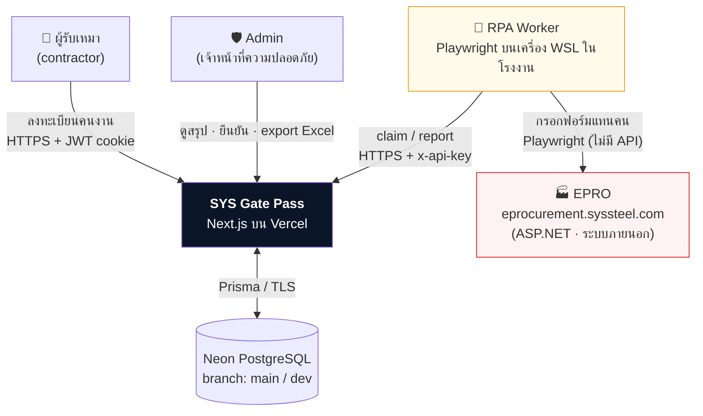
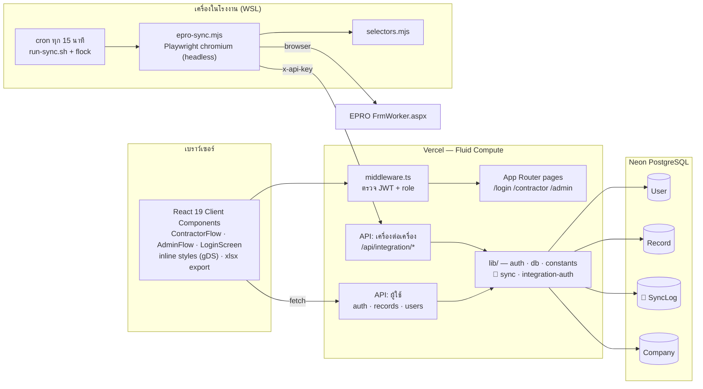
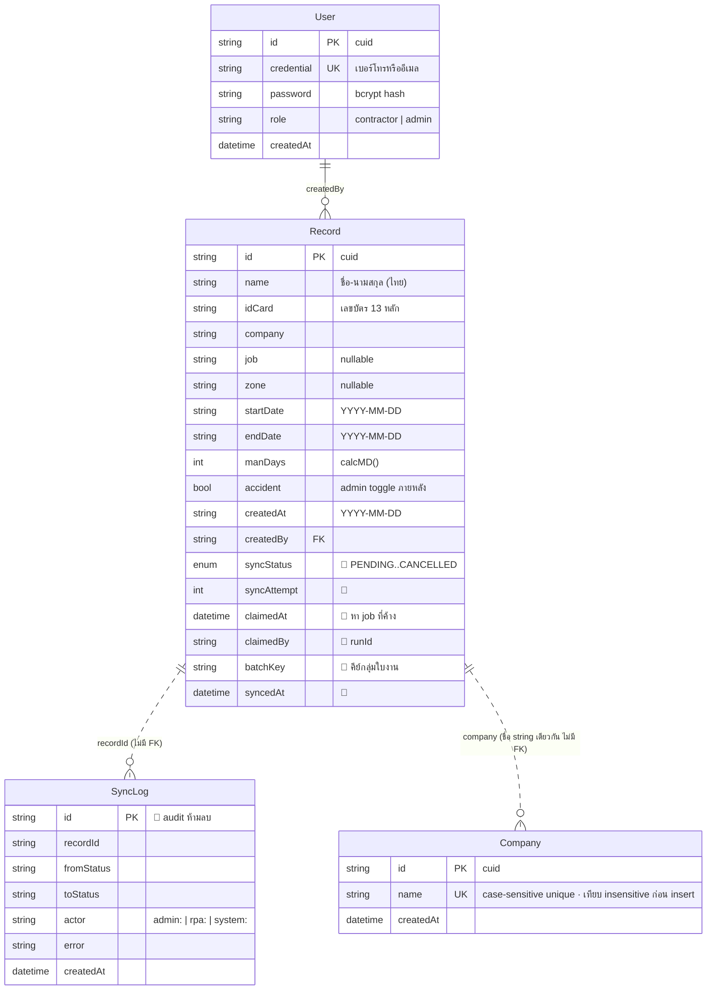
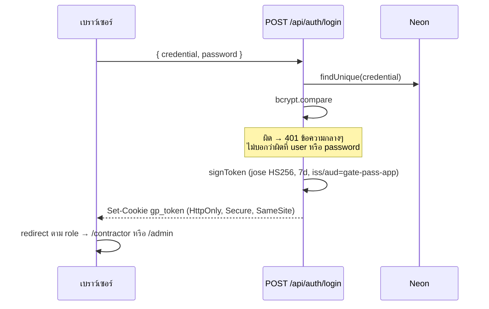
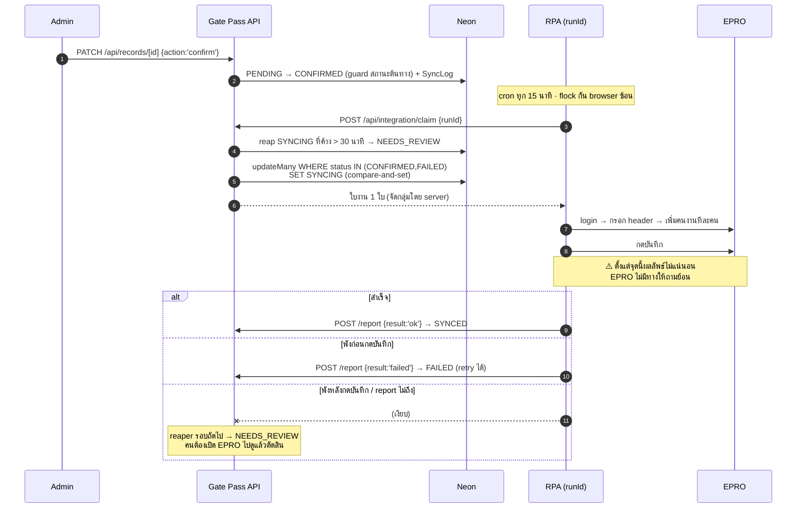
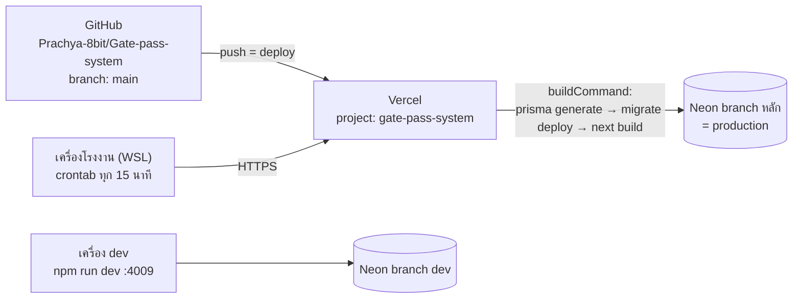

# System Architecture — SYS Gate Pass

ระบบบันทึกใบผ่านเข้าโรงงานและนับ man-day ของผู้รับเหมา พร้อมส่งรายชื่อเข้าระบบ eprocurement (EPRO) อัตโนมัติ

| | |
|---|---|
| สถานะเอกสาร | สะท้อนโค้ดจริง ณ 2026-07-25 · ส่วนที่ยังไม่ได้ทำกำกับด้วย 🔶 **(แผน)** |
| ผู้ใช้ | ผู้รับเหมา + Admin ความปลอดภัย ของโรงงานอุตสาหกรรมไทย |
| ภาษา UI | ไทยทั้งหมด |
| เอกสารที่เกี่ยวข้อง | [`sync-state-machine.md`](./sync-state-machine.md) · [`eprocurement-integration.md`](./eprocurement-integration.md) |

---

## 1. บริบทของระบบ (System Context)



**ข้อจำกัดที่กำหนดสถาปัตยกรรมทั้งหมด:** EPRO **ไม่มี API** ต้องเข้าผ่านการกรอกฟอร์มเว็บเท่านั้น จึงไม่มี idempotency key ไม่มี transaction ไม่มีทางถามย้อนว่า "ส่งไปแล้วหรือยัง" ทุกการตัดสินใจเรื่อง reliability ในเอกสารนี้เกิดจากข้อจำกัดนี้

---

## 2. Container Diagram



### ทำไมแยก RPA ออกจาก Vercel

Playwright ต้องรันเบราว์เซอร์จริง กินเวลาต่อใบงานเป็นนาที และ EPRO อาจอยู่หลัง network ของโรงงาน — ไม่เหมาะกับ serverless function ที่มี timeout จำกัด RPA จึงเป็น **process แยกที่โรงงาน** และคุยกับระบบหลักผ่าน HTTP API เท่านั้น ทำให้ Vercel ไม่ต้องรู้จัก EPRO เลย

---

## 3. Layers ภายในแอป

| Layer | ไฟล์ | หน้าที่ | กฎ |
|---|---|---|---|
| **Presentation** | `components/*.tsx` | UI ทั้งหมด (client components) | inline style จาก `gDS` เท่านั้น · ห้าม Tailwind · ห้าม `localStorage` |
| **Routing / Guard** | `middleware.ts` | กัน `/contractor/*`, `/admin/*` ตาม role | ไม่มี session → redirect `/login` · ผิด role → 403 |
| **API — ผู้ใช้** | `app/api/{auth,records,users,companies}` | รับคำสั่งจากเบราว์เซอร์ · ตรวจสิทธิ์ด้วย cookie | ทุก route ต้องเรียก `getSession()` ก่อนเสมอ |
| **API — เครื่องต่อเครื่อง** | `app/api/integration/*` | ให้ RPA เรียก · ตรวจสิทธิ์ด้วย `x-api-key` | แยก namespace ชัดเจน ไม่ปนกับ API ผู้ใช้ |
| **Domain** | `lib/constants.ts` · `lib/companies.ts` · 🔶 `lib/sync.ts` | `calcMD()`, `gDS` · `ensureCompanyExists()` (auto-add บริษัทใหม่) · 🔶 `groupKey()`, transition rules | business rule ทั้งหมดอยู่ที่นี่ ห้ามอยู่ใน RPA หรือ UI |
| **Data** | `lib/db.ts` · `prisma/schema.prisma` | Prisma client singleton | เข้าถึง DB ผ่าน Prisma เท่านั้น |

**หลักที่ยึด:** ผู้รับเหมาและ RPA ไม่เคยตัดสินใจเชิงธุรกิจ — server เป็นคนตัดสินทั้งหมด (คำนวณ man-day, จัดกลุ่มใบงาน, อนุญาต transition)

---

## 4. Data Model



**`Company`** เป็น lookup table สำหรับ autocomplete เท่านั้น ไม่มี FK กับ `Record.company` — ผู้รับเหมาพิมพ์ชื่อบริษัทใหม่ที่ไม่มีใน list ได้เสมอ (`POST /api/records` จะ upsert ชื่อนั้นเข้า `Company` อัตโนมัติผ่าน `ensureCompanyExists()`)

**ข้อสังเกตเรื่องชนิดข้อมูล:** วันที่เชิงธุรกิจ (`startDate`, `endDate`, `createdAt`) เก็บเป็น `String` รูปแบบ `YYYY-MM-DD` เพราะเป็นวันที่ล้วนและเรียง/เทียบแบบ string ได้ถูกต้อง ส่วน timestamp ของระบบ sync (🔶 `claimedAt`, `syncedAt`) ใช้ `DateTime` เพราะต้องการความละเอียดระดับวินาทีเพื่อคำนวณ timeout/backoff

**Man-day** คำนวณที่ server ตอนสร้างเท่านั้น (`calcMD()` — นับหัวท้าย, ขั้นต่ำ 1 วัน) แล้วเก็บเป็นค่าคงที่ ไม่คำนวณซ้ำตอนอ่าน เพื่อให้ประวัติย้อนหลังไม่เปลี่ยนตามโค้ด

---

## 5. Flow หลัก

### 5.1 Login



ไม่มีการสมัครเอง — Admin สร้างบัญชีผ่าน `POST /api/users` เท่านั้น

### 5.2 ผู้รับเหมาลงทะเบียนคนงาน (batch)

ฟอร์ม 3 ขั้น (ข้อมูลงาน → รายชื่อคน → ยืนยัน) ส่งครั้งเดียวเป็น array → `POST /api/records`
- validate **ทุกคน** ก่อน แล้วจึงเขียน — ผิดคนเดียว = ไม่เขียนเลย (`prisma.$transaction`)
- 1 การส่งฟอร์ม = N records ที่แชร์ข้อมูลงานเดียวกัน
- ทุก record เริ่มที่ 🔶 `syncStatus = PENDING`

### 5.3 Admin ยืนยัน + RPA ส่งเข้า EPRO 🔶



รายละเอียดสถานะทั้ง 7 และ transition table อยู่ใน [`sync-state-machine.md`](./sync-state-machine.md)

---

## 6. Trust boundary & ความปลอดภัย

```
เบราว์เซอร์ ──HTTPS──▶ [ middleware ]──▶ API ผู้ใช้      ← ตรวจ JWT cookie + role
RPA        ──HTTPS──▶ [ x-api-key  ]──▶ API integration ← ตรวจ shared key แบบ timing-safe
Vercel     ──TLS────▶ Neon (pooled connection)
RPA        ──HTTPS──▶ EPRO (บัญชีพนักงานจริง 1 บัญชี)
```

| ประเด็น | วิธีที่ใช้ |
|---|---|
| Session | JWT HS256 (`jose`) ใน cookie `gp_token` — **HttpOnly** JS อ่านไม่ได้ · อายุ 7 วัน · ตรวจ `iss`/`aud` |
| รหัสผ่าน | bcrypt hash เท่านั้น · ไม่เคยเก็บ/log plaintext · error ตอน login เป็นข้อความกลางๆ ไม่บอกว่าผิดตรงไหน |
| แบ่งสิทธิ์ | บังคับ 2 ชั้น — `middleware.ts` กันระดับหน้า และทุก API route เรียก `getSession()` ซ้ำเอง (ห้ามพึ่ง middleware อย่างเดียว) |
| API เครื่องต่อเครื่อง | `x-api-key` เทียบด้วย `timingSafeEqual` · ถ้าไม่ได้ตั้ง `INTEGRATION_API_KEY` ระบบ **fail closed** (503) ไม่ใช่เปิดโล่ง |
| ความลับ | `JWT_SECRET`, `DATABASE_URL`, `INTEGRATION_API_KEY` อยู่ใน Vercel env · `EPRO_USERNAME/PASSWORD` อยู่ใน `automation/.env` บนเครื่องโรงงานเท่านั้น ไม่เคยขึ้น cloud · `.env*` ทั้งหมดถูก gitignore |
| ข้อมูลอ่อนไหว | เลขบัตรประชาชน 13 หลัก เก็บ plaintext (จำเป็นต่อการกรอก EPRO) — เข้าถึงได้เฉพาะ Admin ที่ล็อกอินและ RPA ที่ถือ key |
| Audit | 🔶 `SyncLog` บันทึกทุก state transition พร้อม actor — ห้ามลบ |

**ยังไม่มี (ความเสี่ยงที่รับทราบ):** rate limit ที่หน้า login · การหมุน `INTEGRATION_API_KEY` · การเข้ารหัสเลขบัตรที่ระดับ column

---

## 7. Deployment



| สภาพแวดล้อม | แอป | ฐานข้อมูล | RPA |
|---|---|---|---|
| **dev** | `npm run dev` (port 4009) | Neon branch `dev` ผ่าน `.env.local` | รันมือ `npm run sync:dry` |
| **production** | Vercel (auto-deploy จาก `main`) | Neon branch หลัก (pooled connection) | cron บนเครื่องโรงงาน ชี้ `GATEPASS_URL` ไป prod |

- **Migration** ถูก apply อัตโนมัติทุก deploy ผ่าน `vercel.json` → deploy ที่ migration พังจะไม่ขึ้น production
- **Seed admin** รันมือครั้งเดียวจากเครื่อง dev ชี้ Neon direct connection พร้อม `SEED_ADMIN_PASSWORD`
- **Legacy:** `Dockerfile`, `docker-compose.yml`, `Caddyfile`, `deploy.ps1` เป็นของแผน self-host เดิม (Docker + SQLite) — ใช้ไม่ได้แล้วหลังย้ายเป็น PostgreSQL เก็บไว้อ้างอิงเท่านั้น

---

## 8. โมเดลความล้มเหลว (Failure Model)

หลักการ: **ยอมให้ตกหล่นแล้วมีคนมาเช็ค ดีกว่าส่งซ้ำเงียบๆ** เพราะข้อมูลซ้ำใน EPRO แก้ยากกว่าข้อมูลตกหล่นมาก

| สิ่งที่พัง | ระบบทำอะไร | ต้องมีคนทำอะไร |
|---|---|---|
| Vercel function ล่ม | RPA claim ไม่ได้ → รอบถัดไปลองใหม่ | — |
| Neon ไม่ตอบ | request พัง · ไม่มีอะไรเปลี่ยนสถานะ | — |
| RPA ตายก่อนกดบันทึก | 🔶 `FAILED` → claim ซ้ำอัตโนมัติหลัง backoff 5 นาที (สูงสุด 3 ครั้ง) | — |
| **RPA ตายหลังกดบันทึก** | 🔶 ค้าง `SYNCING` → reaper 30 นาที → `NEEDS_REVIEW` | ✅ เปิด EPRO ดูว่ามีใบงานไหม แล้วกด "ส่งแล้ว"/"ยังไม่ส่ง" |
| EPRO เปลี่ยนหน้า/selector หาย | 🔶 `FAILED` + `errorClass: permanent` → ไม่ retry | ✅ แก้ `selectors.mjs` |
| รหัสผ่าน EPRO หมดอายุ | login พัง · ยังไม่ได้ claim อะไร → ไม่มีสถานะเสียหาย | ✅ แก้ `automation/.env` |
| เครื่อง WSL ดับ | ไม่มีอะไรถูกส่ง · ข้อมูลอยู่ครบใน DB | ✅ เปิดเครื่อง — cron ทำงานต่อเอง |
| sync รอบก่อนยังไม่จบ | `flock` ข้ามรอบนี้ ไม่เปิด browser ซ้อน | — |
| RPA 2 ตัวแย่ง job | compare-and-set ที่ DB — ตัวที่ช้ากว่าได้ `null` | — |

**การกู้คืนทั้งหมดมาจาก database** ไม่มีสถานะสำคัญอยู่ในหน่วยความจำหรือไฟล์บนเครื่อง RPA (🔶 หลังเลิกใช้ `submitted.json`)

---

## 9. Observability

| ชั้น | ปัจจุบัน | 🔶 แผน |
|---|---|---|
| แอป | Vercel runtime logs | — |
| ธุรกิจ | KPI บนหน้า Admin (จำนวนรายการ · man-day · อุบัติเหตุ) | + ตัวนับ 5 สถานะ sync |
| Sync | `automation/logs/sync.log` (text บนเครื่องเดียว ค้นยาก) | `SyncLog` ใน DB ค้นได้ + แถบเตือนแดงบนหน้า Admin |
| Alert | ❌ ไม่มีเลย | แถบแดงบนหน้า Admin (โปรเจกต์ไม่มี email/LINE — ต้องยอมรับว่า alert ต้องมีคนเปิดหน้าดู) |

---

## 10. ข้อจำกัดที่ทราบและทิศทางต่อไป

| ข้อจำกัด | ผลกระทบตอนนี้ | เส้นทางแก้ |
|---|---|---|
| `GET /api/records` ดึงทุกแถวไม่มี pagination | ไม่มีปัญหาที่ระดับหลักร้อยแถว | เพิ่ม pagination + server-side filter เมื่อเกิน ~5,000 แถว |
| KPI คำนวณฝั่ง client จากทุกแถว | เหมือนกัน | ย้ายไป aggregate query |
| RPA มีเครื่องเดียว ไม่มี failover | เครื่องดับ = sync หยุด (ข้อมูลไม่หาย) | สถาปัตยกรรม claim/report รองรับ worker หลายตัวอยู่แล้ว — เพิ่มเครื่องได้ทันทีโดยไม่แก้โค้ด |
| ไม่มี message queue | ไม่จำเป็นที่ scale ปัจจุบัน (โรงงานเดียว · หลักสิบรายการ) | polling API + state machine ย้ายไปเป็น queue consumer ได้โดยไม่แตะ business logic |
| ไม่มี rate limit ที่ login | เสี่ยง brute force | เพิ่ม throttle ต่อ IP/credential |

---

## 11. บันทึกการตัดสินใจเชิงสถาปัตยกรรม

| # | ตัดสินใจ | เหตุผล | ทางเลือกที่ไม่เลือก |
|---|---|---|---|
| 1 | RPA (Playwright) แทน API integration | EPRO ไม่เปิด API ให้ | รอ vendor ทำ API — ไม่มีกำหนด |
| 2 | RPA แยกออกจาก Vercel | เบราว์เซอร์จริงกินเวลาเป็นนาที เกินวิสัย serverless และ EPRO อาจอยู่ใน network โรงงาน | รัน Playwright ใน function |
| 3 | JWT ใน HttpOnly cookie ทำเอง | ระบบเล็ก ผู้ใช้ปิด ไม่ต้องการ SSO/social login | NextAuth / Clerk — เกินความจำเป็น |
| 4 | 🔶 State machine + claim-before-submit | EPRO ไม่มี idempotency — ต้องกันซ้ำที่ฝั่งเรา 100% | boolean flags (แผนเดิม — มีช่องส่งซ้ำ) |
| 5 | 🔶 `NEEDS_REVIEW` ให้คนตัดสิน ไม่ retry อัตโนมัติ | retry เคสที่ไม่รู้ผล = สร้างใบงานซ้ำ | auto-retry ทุกกรณี |
| 6 | เก็บ sync state per-record แต่เปลี่ยนทั้งกลุ่มพร้อมกัน | EPRO รับเป็นใบงาน (หลายคน/ใบ) แต่ธุรกิจนับเป็นรายคน | สร้าง entity `SyncBatch` — ถูกกว่าเชิงทฤษฎีแต่งานเยอะเกินคุ้ม |
| 7 | Inline style จาก `gDS` ไม่ใช้ Tailwind | ต้องตรงกับ prototype จาก Claude Design แบบ pixel-for-pixel | Tailwind |
| 8 | Export Excel ฝั่ง client (`xlsx`) | ไม่ต้องมี endpoint สร้างไฟล์ · ข้อมูลอยู่ในเบราว์เซอร์อยู่แล้ว | สร้างไฟล์ที่ server |
